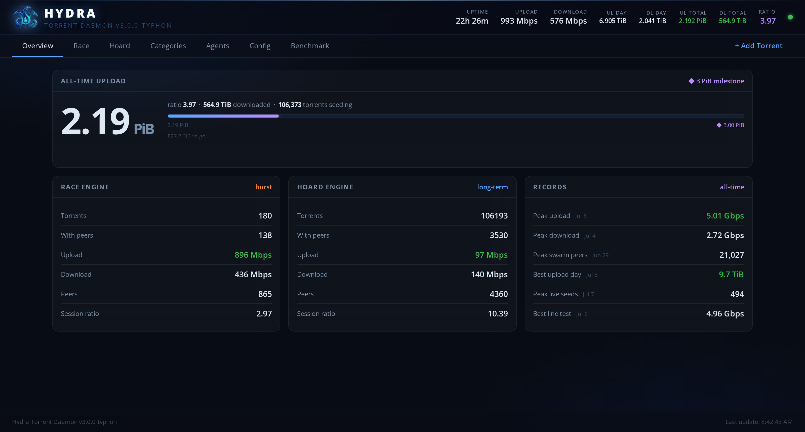
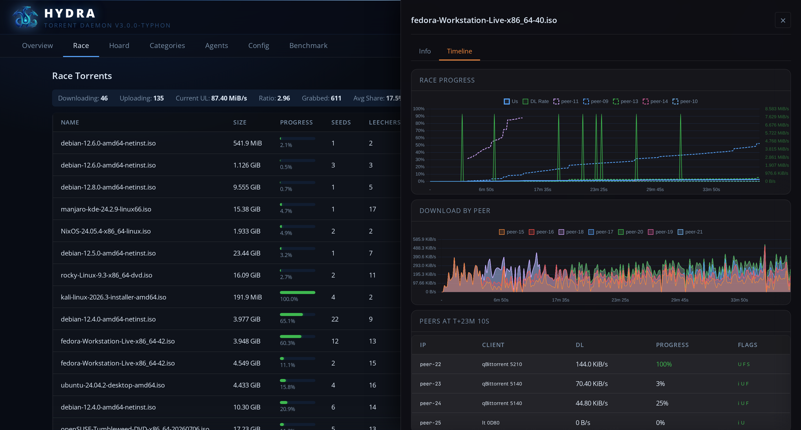
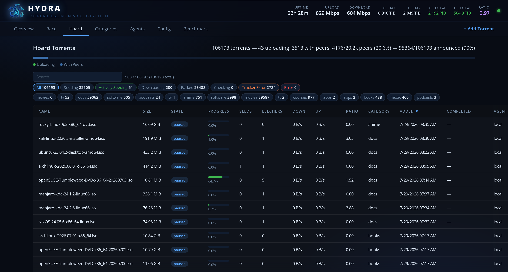
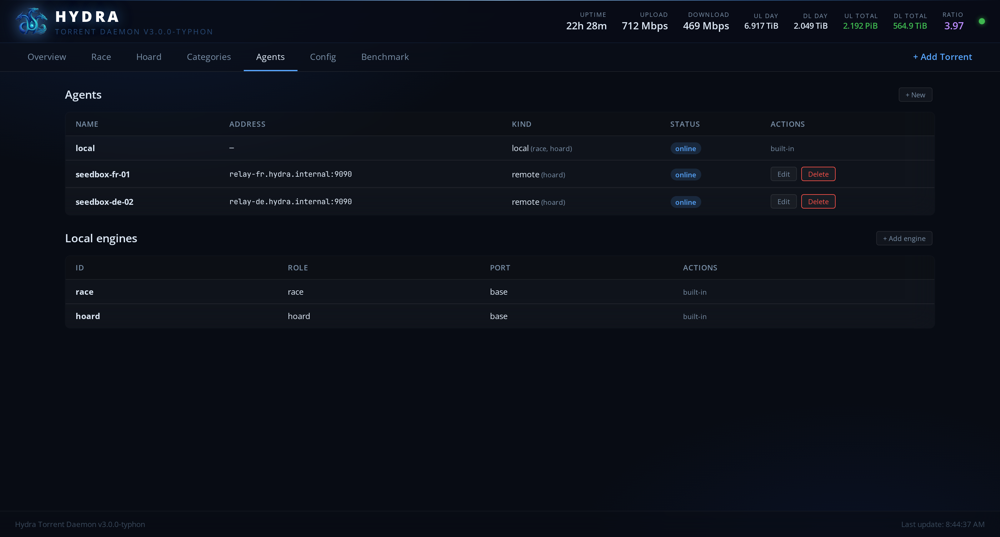
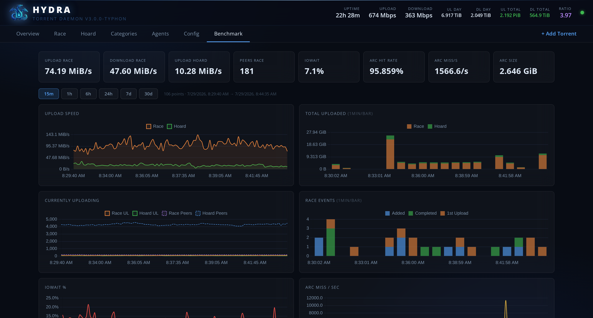

# Hydra

A self-hosted BitTorrent daemon built for **scale and seeding**: a Go control
plane driving a purpose-built Rust engine ("Typhon"). Hydra holds **100k+
torrents** in a single instance, exposes a live web UI, a native REST API, and a
qBittorrent-compatible shim so your existing `*arr` / autobrr / cross-seed setup
just works.

> Status: Hydra is being opened up from a private homelab project. It is used in
> production but some rough edges remain; issues and PRs welcome.

---

## Why Hydra?

- **Two engine roles.** A **race** session (aggressive, low-latency, for hot
  downloads) and a **hoard** session (upload-optimized, for long-term seeding),
  each tuned independently. You can also run any number of extra engines.
- **Scales.** Tens of thousands of torrents per instance, with a push-based
  (SSE) UI that streams the torrent list instead of shipping giant REST blobs.
- **Flexible networking.** Direct, SOCKS5 egress, a lightweight PROXY-v2 relay
  (change your seedbox's public IP without a VPN tunnel), or gluetun with
  **hot listen-port rebind** (no restart when your VPN's forwarded port rotates).
- **Distributed.** Run engines across several machines and aggregate them behind
  one front; route new torrents per-category with placement/strategy and a
  save-path per agent.
- **Data-aware adds.** Add a torrent whose data is already on disk (a re-add, a
  cross-seed, or a half-finished download) and Hydra hash-checks what's there
  instead of blindly re-downloading over it: verified pieces are kept and
  served, the rest is fetched.
- **Drop-in.** A qBittorrent v2 API shim means autobrr, Sonarr/Radarr,
  cross-seed, etc. talk to Hydra unchanged.

---

## Screenshots

**Overview** — live dashboard: global up/down, seeding/leeching counts,
per-session throughput, all streamed over SSE.



**Race** — per-torrent detail with live peer speed and progress timelines for
the hot download you're racing.



**Hoard** — the long-term seeding set: tens of thousands of torrents in one
virtualized, push-updated table.



**Agents** — run engines across several machines and manage them from one
front: status, free space, and per-engine roles.



**Benchmark** — built-in throughput history so you can see exactly what your
box sustains.



---

## Who can reach the API

Both API surfaces are authenticated, and both give full control of the daemon
-- including deleting torrents together with their files:

- **Native `/api/*`** takes the daemon API key in `X-Api-Key` (or `?apikey=`).
  The key is generated on first boot and lives in `[daemon] api_key`. The web
  UI gets it from `/api/login` after a username/password check against
  `[auth]`.
- **qBittorrent shim `/api/v2/*`** takes either the same API key or a `SID`
  cookie from `POST /api/v2/auth/login`, which checks the same `[auth]`
  credentials. Point autobrr, cross-seed and friends at those.

Set an admin account (`hydra hash-password`, or the settings UI) before Hydra
is reachable by anything you do not control. Hydra has no rate limiting, no
account lockout and no TLS of its own: if you expose it beyond a trusted LAN,
put it behind a reverse proxy that terminates TLS.

---

## Give Hydra time to stop

On SIGTERM Hydra saves its store and then asks each engine to flush its resume
data. Docker kills a container ten seconds after SIGTERM by default, which is
not enough to get through both engines: the flush is cut short and the next
start re-checks pieces that were already complete.

The bundled [`docker-compose.yml`](docker-compose.yml) sets
`stop_grace_period: 30s` for you. If you run Hydra with a plain `docker run`,
pass the same budget yourself:

```bash
docker run --stop-timeout 30 ...      # and: docker stop -t 30 hydra
```

Each engine gets ten seconds of that budget, and the two are stopped one after
the other. If you hold several hundred thousand torrents the sweep takes
longer -- raise `HYDRA_STOP_TIMEOUT` (e.g. `45s`) and keep the supervisor's
grace period above twice that.

---

## Documentation

Install steps, architecture, every networking mode and the edge cases live in
the **[Wiki](https://github.com/Kheopsian/Hydra/wiki)**:

- [Installation & First Run](https://github.com/Kheopsian/Hydra/wiki/Installation-and-First-Run)
- [Architecture](https://github.com/Kheopsian/Hydra/wiki/Architecture)
- [Networking Modes](https://github.com/Kheopsian/Hydra/wiki/Networking-Modes)
- [Deployment Topologies](https://github.com/Kheopsian/Hydra/wiki/Deployment-Topologies)
- [Categories & Routing](https://github.com/Kheopsian/Hydra/wiki/Categories-and-Routing)
- [Adding Torrents & Existing Data](https://github.com/Kheopsian/Hydra/wiki/Adding-Torrents-and-Existing-Data)
- [qBittorrent Shim & Automation](https://github.com/Kheopsian/Hydra/wiki/qBittorrent-Shim-and-Automation)
- [Configuration Reference](https://github.com/Kheopsian/Hydra/wiki/Configuration-Reference)
- [Troubleshooting](https://github.com/Kheopsian/Hydra/wiki/Troubleshooting)

API reference: [`docs/API.md`](docs/API.md). Companion VPS relay:
[hydra-relay](https://github.com/Kheopsian/hydra-relay).

---

## License

Hydra is licensed under the **GNU Affero General Public License v3.0** (AGPL-3.0).
See [`LICENSE`](LICENSE). In short: you're free to run, study, modify, and
share it, including self-hosting a modified version, but if you offer a modified
Hydra to others over a network, you must make your source available under the
same license.
