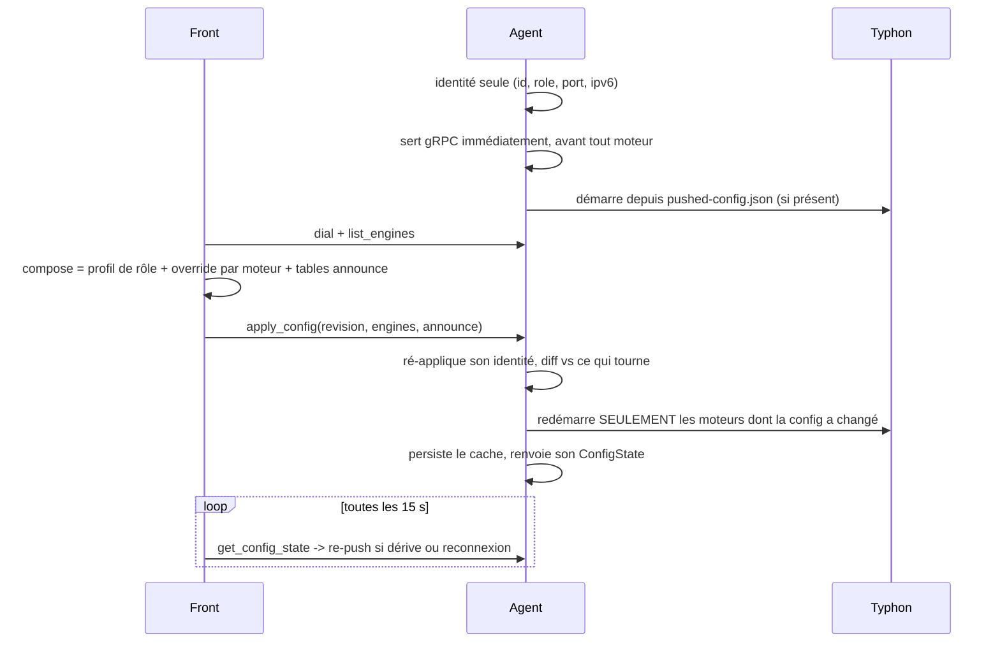

# Hydra — architecture distribuée agent / front (Phase C)

Statut : DESIGN (2026-07-24). Décisions arrêtées avec the operator. Transport agent↔front = gRPC.

## 1. Motivation

Aujourd'hui `hydra-go` = orchestrateur + front + hôte-moteur dans un seul process.
Objectif : brancher N moteurs (hoard/race) répartis sur plusieurs machines à un
seul plan de contrôle. Ex : 1 hoard en Allemagne, 1 en France, 1 en Suisse,
1 race en local, 1 GUI local qui pilote tout et à qui les *arr parlent.

Split en deux rôles (control-plane / data-plane) :
- **hydra-agent** (data-plane) : 1 par lieu. Héberge le(s) moteur(s) Typhon +
  toute la logique qui DOIT être co-localisée avec eux.
- **hydra-front** (control-plane) : 1 seul, local. GUI, shim qBit pour les *arr,
  agrégation, routage. Ne touche jamais un fichier ni un peer.

~90% du code Go actuel est re-homé, pas réécrit.

## 2. Frontières & protocoles (3 frontières, 3 protocoles)

| Frontière | Protocole | Pourquoi |
|---|---|---|
| **agent ↔ front** | **gRPC** (HTTP/2, protobuf) | contrat typé stable, streaming, mTLS/token, deadlines/backpressure |
| front ↔ navigateur | HTTP/REST + SSE (inchangé) | le browser n'est pas gRPC-friendly (grpc-web = proxy inutile ici) |
| front ↔ *arr | shim qBit HTTP (inchangé) | autobrr/Sonarr/Radarr attendent du HTTP qBit |
| agent ↔ Typhon | JSON-RPC NDJSON sur Unix socket (inchangé) | local, rapide, Typhon=Rust, aucun gain à changer |

gRPC = **uniquement la face sud de l'agent**. Pas de gRPC-web, pas de gRPC vers Typhon.

## 3. Qui vit où

**Agent (co-localisé, dépend de l'IP/du disque local) :**
- moteurs Typhon (race + hoard)
- **scheduler d'annonce** (l'egress compte : l'agent DE annonce DEPUIS l'Allemagne, son propre VPS/FOU)
- choking, disk I/O, slot manager, drain, tracker announce
- `state.json` par agent, resume/fastresume par agent
- data payload (vit à côté du moteur)

**Front (control-plane) :**
- GUI + SSE vers le navigateur
- shim qBit pour les *arr
- agrégation (group-by-hash des listes des N agents)
- routage / placement (un *arr add → quel agent ?)
- registre des catégories (source de vérité)
- collecte/agrégation bench, dedup cross-agent

## 4. Contrat gRPC (esquisse `.proto`)

```proto
service HydraAgent {
  rpc GetAgentInfo(Empty) returns (AgentInfo);        // name, data_roots, version, caps
  rpc Ping(Empty) returns (Pong);

  // Contrôle (unary) — miroir de RaceEngine/HoardEngine
  rpc AddTorrent(AddRequest) returns (AddReply);
  rpc RemoveTorrent(RemoveRequest) returns (Empty);
  rpc StartTorrent(Ref) returns (Empty);
  rpc StopTorrent(Ref) returns (Empty);
  rpc VerifyTorrent(Ref) returns (Empty);
  rpc SetCategory(SetCategoryRequest) returns (Empty);

  // Lecture
  rpc ListTorrents(ListRequest) returns (TorrentSnapshot);   // full snapshot (resync)
  rpc GetTorrent(Ref) returns (TorrentStatus);
  rpc GetSessionStats(Empty) returns (SessionStats);

  // Streaming — lifecycle + snapshots stats (remplace le snapshot pusher SSE actuel)
  rpc SubscribeEvents(SubscribeRequest) returns (stream AgentEvent);
}
```

**Auth** : token en per-RPC metadata sur TLS par défaut (bootstrap facile pour un
user OSS) ; mTLS en option (chaque agent+front a un cert) pour les parano.
Pas de dépendance à un underlay wireguard/FOU.

**Reconnect/resync** : un stream gRPC meurt sur blip réseau. À la (re)connexion le
front fait `ListTorrents` (snapshot full) puis `SubscribeEvents` (delta). C'est
exactement le pattern *snapshot + delta* déjà en place en SSE — on le remonte
d'un cran : agent gRPC-stream → front agrège → ré-émet en SSE vers le navigateur.

## 5. Identité & multi-home

- Identité torrent : **`info_hash → Set<agent>`** (un torrent peut vivre sur N agents).
- Le multi-seed est **natif BitTorrent** : les agents ne coordonnent RIEN au niveau wire.
- Multi-home réel = stats HONNÊTES (chaque agent uploade vraiment) — ≠ l'ancien bug
  secondary_stats (fantôme). Le seul risque = **règles tracker privé** (multi-seedbox
  autorisé ?) → **warning dismissible** (les gens qui font du multi-client sont conscients).
- `secondary_stats` (dual-stack VPS) devient **par-agent** sur les trackers qui somment par peer_id.
- **Réplication data = HORS-SCOPE v1** : on assume la data déjà présente sur l'agent (comme le seed-existing d'aujourd'hui).

## 6. Modèle de catégories (B2, per-agent)

Une catégorie = objet **front** :
```
Category {
  name        string
  mode        "race" | "hoard"
  placement   []agent | policy   // quels agents hébergent les nouveaux torrents de cette cat
  save_path   map[agent]path     // dérivé <agent.data_root>/<name> par défaut, override par (cat,agent)
}
```
- **Dégénère proprement en mono-agent** : 1 agent "local" → 1 seul save_path. C'est
  l'état actuel. En multi-agent la map grossit. **Zéro rework entre mono et multi.**
- On-disk **forward-compatible** : garder le `save_path` plat (= agent local/défaut),
  ajouter un `agents: {agentName: path}` optionnel. Résolution : `agents[a]` sinon `save_path` plat.
- **Placement** : nécessaire parce qu'un *arr add via le shim porte SEULEMENT la
  catégorie (pas d'agent) → c'est la politique de placement de la catégorie qui dit
  au front où router.
- Changer un save_path n'affecte que les **nouveaux** torrents (pas de move auto — comme qBit).

## 7. Plan de PRs (staged)

1. **Schéma catégorie forward-compatible** (per-agent map optionnelle, back-compat, helper de résolution). Faisable MAINTENANT, mono-agent, testable. ← on commence par là.
2. Définir le `.proto` + génération (buf/protoc) ; serveur gRPC agent qui wrappe les moteurs existants ; front parle en loopback d'abord (tout local).
3. Extraire les 2 binaires `hydra-agent` (data-plane) / `hydra-front` (control-plane), toujours en local.
4. Transport réseau + auth (TLS/token), 1 agent distant.
5. Agrégation + routage dans le front (group-by-hash, placement).
6. Identité multi-home (`Set<agent>`), secondary_stats per-agent, warning.
7. Durcissement failover/reconnect (agent down → front dégradé, *arr continuent sur les autres).

## 8. Configuration pilotée par le front (IMPLÉMENTÉ)

Un agent ne configure plus rien lui-même. Il connaît uniquement son **identité**
— pour chaque moteur : `id`, `role`, `listen_port`, `enable_ipv6` — et reçoit
tout le reste du front : réglages de session, egress, choking, disk slots et les
quatre familles d'overrides d'annonce. Ces quatre valeurs restent à l'agent
parce qu'elles décrivent SA machine (le port que son VPN forwarde, les familles
que ses interfaces portent) : un front ne peut pas les connaître.

Avant, tout était dupliqué dans le `default.toml` de chaque nœud, et un agent
qui redémarrait revenait silencieusement sur sa propre copie — divergente dès la
première modification faite depuis l'UI.

### 8.1 Flux de push



L'agent sert gRPC **avant** d'avoir le moindre moteur : le front doit pouvoir
l'atteindre pour lui donner la configuration dont ses moteurs ont besoin.
`list_engines` répond depuis l'identité déclarée, donc un nœud sans config dit
quand même au front quoi composer pour lui.

Le push est **réconcilié, pas one-shot** : une boucle de 15 s redial les agents
absents et compare la révision annoncée par chaque agent à celle qu'elle
enverrait. C'est ce qui couvre le cas qui cassait avant — un agent qui
redémarre. Une écriture de réglages depuis l'UI déclenche un push immédiat
plutôt que d'attendre le tick.

`revision` est un **hash FNV du contenu** du payload : une config identique
donne toujours le même nombre, donc re-pousser est idempotent et une flotte
stable reste silencieuse. Pas de compteur à persister côté front.

### 8.2 Précédence profil / override

| Source | Portée |
|---|---|
| `[race]` / `[hoard]` du front | profil de flotte pour tous les moteurs distants de ce rôle |
| `[[agent.engine]]` sous un `[[agent]]` | exception **éparse** pour un moteur précis, par `id` |
| identité de boot de l'agent | `listen_port` et `enable_ipv6`, réappliqués par-dessus tout le reste |

Les overrides sont fusionnés clé par clé sur la forme TOML encodée du profil, y
compris dans les sous-tables (`custom_choking`, `disk_slots`), donc écrire une
seule clé n'efface pas le reste. Le front **omet** `listen_port` et
`enable_ipv6` du payload, et l'agent les réapplique de toute façon : une erreur
côté front ne peut pas déplacer le port d'un agent.

Les tables `[announce_passkeys]`, `[announce_clients]`,
`[announce_secondary_stats]` et `[announce_ip_modes]` ne vivent plus que sur le
front. Elles sont poussées **en remplacement** (pas en fusion) : un override
supprimé sur le front s'exprime par une absence, et fusionner laisserait l'agent
annoncer sous une passkey que plus personne ne voit. Elles sont lues à chaque
annonce, donc une modification traverse toute la flotte sans redémarrer un seul
moteur.

### 8.3 Cache et démarrage hors-ligne

L'agent écrit `{data_dir}/pushed-config.json` **après** une application réussie.
Au boot il applique ce cache immédiatement, sans attendre le front : un nœud qui
redémarre pendant que son front est down revient en seed sur la dernière
configuration reçue, au lieu d'attendre un push qui peut être à des heures. Le
cache est ignoré s'il nomme d'autres moteurs que ceux déclarés — il vient alors
d'un nœud dont celui-ci a repris le volume.

`ConfigState.Source` dit d'où vient ce qui tourne : `front` (poussé pendant
cette vie du process), `cache`, `local` (ancien mode : config de session lue
dans le TOML du nœud) ou `none` (moteurs déclarés, aucune config, moteurs à
l'arrêt). Tout ce qui n'est pas `front` est ce sur quoi le réconciliateur agit.
`GET /api/agents` expose la révision et l'état par moteur.

### 8.4 Redémarrage sélectif

À chaque push, l'agent compare la `SessionConfig` effective de chaque moteur à
celle sur laquelle il tourne. Identique → rien. Différente → ce moteur seul est
arrêté et relancé (`store.db` par moteur rend le re-import sans perte), les
autres continuent. Les overrides d'annonce sont hors de cette comparaison :
ils sont chauds, donc un changement de spoofing ne redémarre rien.

Le hub d'événements appartient à l'agent, pas au moteur, et le moteur courant y
est pompé : sans ça toute souscription du front mourrait à chaque changement de
config — silencieusement, et remarqué seulement comme une UI qui a cessé de se
rafraîchir.

Un moteur qui n'a pas démarré est réessayé toutes les 30 s sur la configuration
déjà en vigueur. Le front ne re-pousse pas de lui-même : il compare les
révisions, les voit égales et se tait. Sans cette reprise locale, un nœud dont
le montage de données arrive en retard resterait à l'arrêt jusqu'à la prochaine
modification de config — qui peut ne jamais venir.

### 8.5 Paramètres de boot de l'agent

Chaque paramètre est réglable de trois façons, résolues **flag > env > TOML >
défaut** (la même précédence que le token d'agent) :

- `--engine id=race-0,role=race,port=12314,ipv6=true`, répétable ;
- `HYDRA_ENGINES` pour la forme multi-moteurs, même grammaire, séparée par `;` ;
- `HYDRA_ENGINE_ID` / `_ROLE` / `_LISTEN_PORT` / `_ENABLE_IPV6` pour le cas
  courant d'un rôle par conteneur ;
- ou des blocs `[[engine]]` minimaux dans un TOML.

Plomberie : `HYDRA_AGENT_ADDR`, `HYDRA_DATA_DIR`, `HYDRA_AGENT_TLS_CERT`,
`HYDRA_AGENT_TLS_KEY`, `HYDRA_LISTEN_PORT_HOOK`, `HYDRA_HEALTH_ADDR`,
`HYDRA_AGENT_TOKEN`.
(`HYDRA_ENGINE_BIN` et `HYDRA_ENGINE_TCP` existaient déjà et désignent le
*process* moteur — binaire, transport IPC — pas son identité.)

Une identité malformée fait échouer le boot : id vide, rôle hors
`race`/`hoard`, port hors bornes, ids ou ports dupliqués. Une variable mal
écrite ne doit pas dégrader en silence vers un port par défaut. L'identité
résolue et sa source sont loguées au démarrage.

Quand l'identité vient des flags ou de l'environnement, le nœud tourne **sans
aucun fichier de config** : `entrypoint.sh` ne sème alors pas de `default.toml`,
sinon chaque agent « sans fichier » recevrait quand même un template complet
dans son volume — exactement la duplication que ce travail supprime.
[test-env/compose.yml](../test-env/compose.yml) en est l'exemple qui tourne.

## 9. Points durs (tous côté agent↔front)

- **Modèle de panne** : aujourd'hui rien ne tombe (tout local). Demain un agent part
  en vrac → le front doit rester réactif (pull par-agent avec timeout, merge ce qui
  répond), les *arr continuent sur les autres, les add vers l'agent mort échouent/queue.
- **Latence** : IPC sub-ms → 20-40ms vers l'Allemagne. Front async partout, jamais bloquer le GUI sur un agent lent.
- **Agrégation** : group-by-hash + merge des stats (pas une simple concat), fan-out sur delete/pause.
